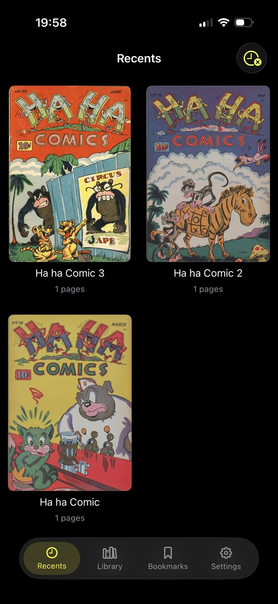
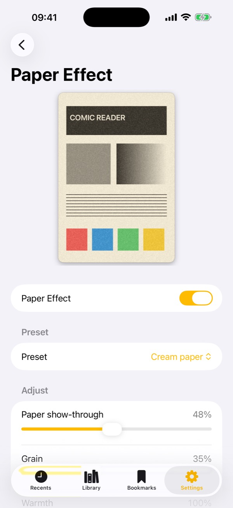

<p align="center">
  
</p>

# Paper Comic Reader

A lean, native comic reader for iPhone and iPad that makes pages read like ink on paper instead of a backlit screen.

[](https://github.com/Wiredframe/paper-comic-reader/releases) [](https://github.com/Wiredframe/paper-comic-reader/releases) [](LICENSE)

<p align="center">
  
  &nbsp;&nbsp;
  
</p>

Paper Comic Reader opens **CBZ** archives, keeps a library with reading progress and bookmarks, and can render every page with a realistic **paper effect** (ported from the Simple Comic fork) — a warm tonal remap plus a fine paper grain, so pages read like they were printed.

Built with SwiftUI and a UIKit reader core, Core Image and Metal for the paper effect. Everything runs on-device: no accounts, no network requests, no tracking or analytics.


## Install

Paper Comic Reader is **not on the App Store** — it ships as an **unsigned `.ipa`** on the [Releases page](https://github.com/Wiredframe/paper-comic-reader/releases). iOS won't install an `.ipa` directly, so you sideload it with a tool that re-signs it with your own Apple ID:

- **[AltStore](https://altstore.io)** — run AltServer on a Mac or PC, then open the `.ipa` in AltStore on the device. A free Apple ID works, but the app stops launching after **7 days** until AltStore refreshes it (a paid Apple Developer account lasts a year).
- **[Sideloadly](https://sideloadly.io)** — connect the device to a Mac or PC and load the `.ipa`. Same 7-day limit on a free Apple ID.

Requires **iOS 26 or later**.


## Project setup

The Xcode project is generated with [XcodeGen](https://github.com/yonaskolb/XcodeGen) from `project.yml`, so file and target changes stay easy to review and merge.

```bash
brew install xcodegen        # once
xcodegen generate            # regenerate ComicReader.xcodeproj after editing project.yml
open ComicReader.xcodeproj   # or build from the command line:
xcodebuild -project ComicReader.xcodeproj -scheme ComicReader \
  -destination 'generic/platform=iOS Simulator' build
```

The generated `.xcodeproj` opens directly in Xcode without XcodeGen — you only need XcodeGen when you change `project.yml`. Signing is **automatic** with the developer team (`DEVELOPMENT_TEAM` in `project.yml`): Simulator builds need no profile, device and archive builds create one via your Apple ID (Xcode → Settings → Accounts). Shipping builds go out as an unsigned `.ipa` — see **Releasing** below.

Deployment target: iOS 26 · Bundle id: `de.wiredframe.comicreader`


## Releasing

`scripts/build-ipa.sh` archives the app **unsigned** and packages a sideloadable `build/PaperComicReader-<version>.ipa`. Pushing a `v*` tag runs the same script on CI (`.github/workflows/release.yml`) and attaches the `.ipa` to a GitHub Release:

```bash
./scripts/build-ipa.sh                    # build one locally
git tag v1.0.0 && git push origin v1.0.0  # or let CI build + publish it
```

The `.ipa` is deliberately unsigned; sideload tools re-sign it per user (see **Install**). It must **not** be uploaded to the App Store.


## Structure

```
ComicReader/
  App/            ComicReaderApp (@main, SwiftData container) · RootTabView (floating tab bar)
  Archive/        ComicArchive — CBZ reading (ZIPFoundation)
  Model/          SwiftData models (ComicBook, Bookmark) · ComicInfo parser · Storage · ImageDownsampler · Importer
  Library/        Recents / Library / Bookmarks tabs, cover grid, gallery/list, import
  Reader/         UIKit paged, zoomable reader core + SwiftUI chrome, page grid, bookmarks
  PaperEffect/    Platform-neutral paper engine (PaperFilter + PaperKernels.metal) + settings
  Settings/       Reader / paper / library settings
  Resources/      Assets.xcassets (AppIcon + AccentColor)
```

### Formats and persistence

- **CBZ** via [ZIPFoundation](https://github.com/weichsel/ZIPFoundation) (SPM). CBR/RAR was supported until 1.2.2 through a vendored UnrarKit; it was dropped in favour of a CBZ-only library, which removed ~160 vendored C++ files and the Objective-C bridging header along with it.
- **Library** is a [SwiftData](https://developer.apple.com/xcode/swiftdata/) store; archives, covers and bookmark thumbnails are files on disk (see `Storage`).
- **Metadata** is the archive's `ComicInfo.xml` (the ComicRack schema every tagger writes), parsed once at import by `ComicInfoParser` onto the `ComicBook` — no view ever touches XML. Comics imported before a tagging run are read on the next launch (`Importer.backfillMetadata`), which is what `metadataScanned` is for. Every view then names a comic through `displayTitle` / `displaySubtitle` ("Topolino 1900" / its lead story, falling back to the file name), and `ComicMetadataSection` renders the full picture — inline under the Discover carousel's bookmarks, and inside `ComicDetailView`'s sheet for the grid and the list.
  ComicInfo has no field for an issue's *contents*, so taggers write the index into `<Summary>` as free text; the parser lifts it back out into `ComicStory` rows, and falls back to showing the raw summary when the format doesn't match.

### The reader

Full-bleed paged UIKit core — a horizontal, paging `UICollectionView` (`ReaderCollectionController`) of `ReaderPageCell`s — wrapped for SwiftUI. There is no pinch zoom: a **double-tap toggles the fit** instead (single page: fit-width ⇄ fit-height), which keeps the layout drift-free. In landscape, an optional **double-page** mode shows two pages side by side with a *fixed* pairing (cover alone, then 2·3, 4·5 …, so a right-half page never becomes a left half); a double-tap there focuses the tapped page at fit-width. Rotation re-fits the page animated. An optional "tap to navigate" mode taps through the page half a screen at a time. An optional **page shadow** rests the page on the letterbox mat — one shadow around the whole spread, so the gutter stays clean. The reader resumes on the last read page and has a page-grid picker. Bookmarks (page screenshots) are added from the reader and browsed globally in the **Bookmarks tab** — tapping one opens that comic straight to the page.

### The paper effect

`PaperFilter` is engine-only and reusable: a warm-cream tonal remap plus an even, isotropic paper grain (`PaperKernels.metal`) laid over the page two ways — a multiply "body" plus a screen "show-through". It falls back to pure Core Image if the Metal kernel can't load, with a global on/off switch in Settings.

> The kernel needs the Metal toolchain to build. On Xcode 26 that's a one-time `xcodebuild -downloadComponent MetalToolchain`.


## Roadmap

The goal above everything: **stay lean and fast**. Panel detection must run on-device as efficiently and battery-friendly as possible.

**Done** — open CBZ, library with folders, paged zoomable reader, resume, global bookmarks with thumbnails, page-grid picker, paper effect, Live Text setting, double-page landscape layout, random comic picker, ComicInfo.xml metadata.

**Next**

1. **Deeper Live Text / OCR** — native VisionKit Live Text (press-and-hold to select) is already toggleable in Settings; copy, speak and per-page caching come next.
2. **Panel detection and smart zoom** — detect panels once per page (cache the rects), then guided zoom. Don't over-zoom: the priority is only that the target panel is in view, and *equally* that the comic fills the **full screen width** whenever possible. Adjustable min/max, hysteresis; detection downscaled on a background queue.

Out of scope (dropped): library search, OPDS. A page-curl open/close transition was prototyped and removed; it may be redone later.
